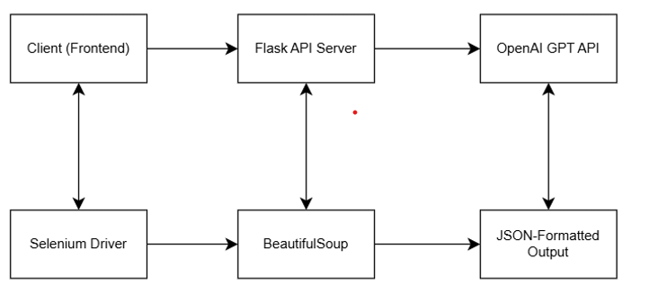
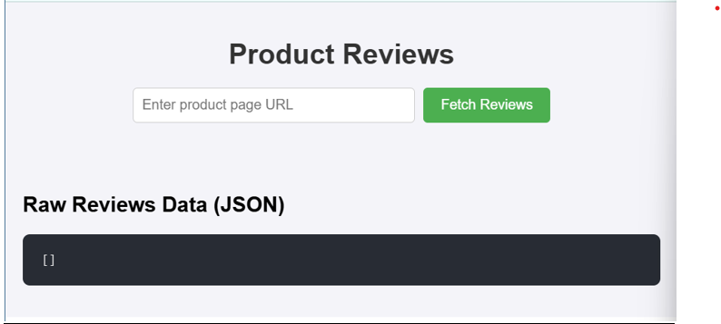
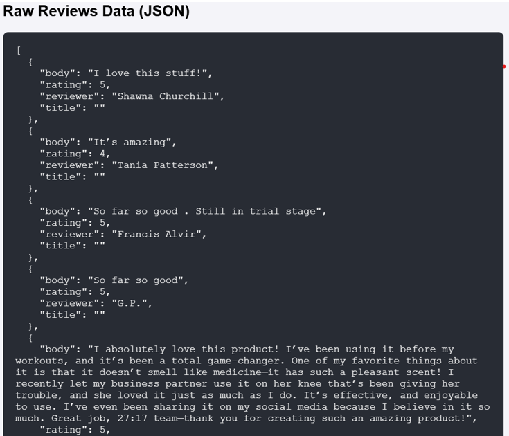

***[Web Scraping API with Review Extraction using LLMs]{.underline}***

***[Introduction:]{.underline}***

*This project is Flask-based web scraping API that extracts review data
from product pages. It uses Selenium for browser automation,
BeautifulSoup for HTML parsing, and OpenAI's GPT API for intelligently
extraction structured review information from raw HTML*

***[Solution Approach:]{.underline}***

1.  ***Web Page Scraping:***

    1.  *Selenium is used to stimulate browser interactions to navigate
        through product pages and the HTML content of all pages is
        collected*

2.  ***HTML Parsing:***

    1.  *BeautifulSoup parses the HTML to identify and isolate
        review-related sections and custom logic identifies review
        containers based on their CSS class names or patterns*

3.  ***Review Data Extraction:***

    1.  *The isolated HTML review sections are passed to OpenAI's GPT
        model and the model extracts structured data including reviewer
        name, review title, content, and rating*

4.  ***API Response:***

    1.  *The extracted data is formatted as JSON and returned as the API
        response*

***[System Architecture:]{.underline}***

{width="6.268055555555556in" height="2.90625in"}

***[How to run the project:]{.underline}***

1.  *Install the requirements as specified in the requirements.txt file*

2.  *Install NodeJS*

3.  *In the terminal through **npm** create an app using the command
    **npx create-react-app "app-name"** (For WindowsOS)*

4.  *Download the github repository, also create a **.env** file and
    mention OpenAI API key and Firecrawl API Key*

5.  *Once the app is created, navigate to that folder, in the src folder
    again, open the file **App.js** and replace it contents by the
    contents present in **src/App.js** in the github repository*

6.  *Also, replace the contents of **App.css** with the contents present
    in **src/App.css** in the github repository*

7.  *Now, run the **flask_app.py** and in another terminal type **npm
    start** from the directory the src files are present.*

8.  *Enter the URL in the input space provided and then run and wait for
    a while for the results to be loaded onto the webpage.*

> ***[Output:]{.underline}***
>
> {width="6.268055555555556in"
> height="2.9965277777777777in"}
>
> {width="6.268055555555556in" height="5.3375in"}
>
> ***If any issues, please react out to me on:***
>
> ***Email ID:** <dhanush.padmanabhar@gmail.com>*
>
> ***Phone No:*** *(+91) 9739661564*
